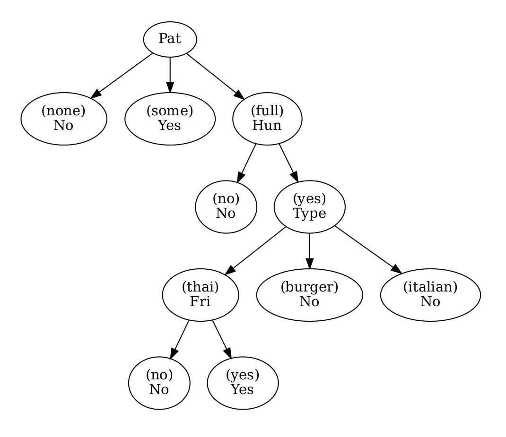

# Decision Tree

In this code i wrote a program that create a decision tree without using any library and from scratch.
The input of the program is a csv file which contains the attribute to makes decision weather wait to eat in a restaurant or not.
The output is a graphical view of the decision tree.
Here is the result:

